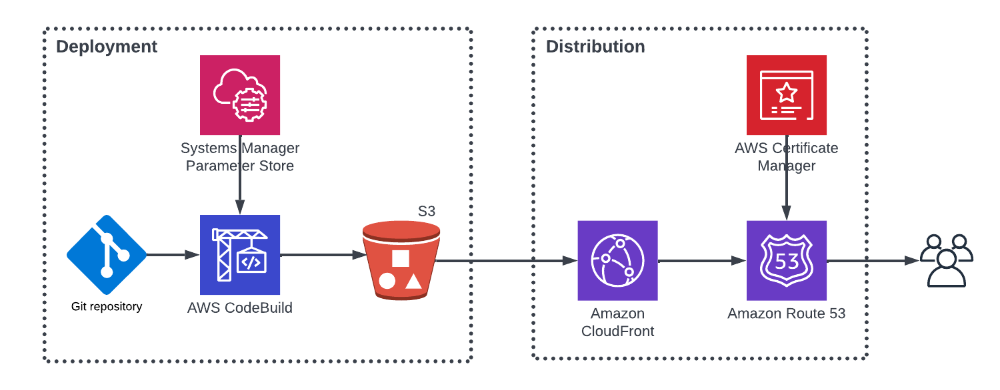

# MishaMultiPoster Terraform Configuration
Terraform configuration for the MishaMultiPoster Facbook application website. 

The website files are hosted in an S3 bucket. They are distributed via CloudFront distribution and a Route 53 hosted zone. 

The deployment of the files to S3 is done by CodeDeploy. It listens for commits in the website [github repository](https://github.com/vkacharov/misha-multi-poster-website). The CodeDeploy build obtains the Facebook application id from Systems Manager Parameter Store. 



### Running locally
When executing the Terraform script locally, the Facebook application id has to be passed in as an input variable

```
terraform apply -var="ApplicationId=12345"
```